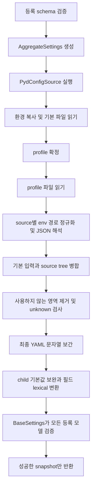

# pydconfig 상세 설계서

상태: 구현 전 설계 v4. 사용자 지정 필수 기반은 pydantic·pydantic-settings·python-dotenv다. 기준 요구사항은 [기획서 R1–R14](product-plan.md#요구사항과-인수-기준)다. 아래 signature와 자료구조는 공개·내부 API의 목표 계약이며 실행 가능한 라이브러리가 아직 있는 것은 아니다.

## 설계 결정

| ID | 결정 | 이유와 비용 |
| --- | --- | --- |
| D1 | pydantic v2·pydantic-settings v2·python-dotenv를 필수 사용 | registry는 loader, 소스 실행과 aggregate 검증은 BaseSettings custom source, dotenv 파싱은 python-dotenv가 담당한다. |
| D2 | 단일 profile, YAML 최상단 `profile` | 파일 선택을 검증 전에 확정한다. 복수 profile 병합은 별도 계약이 필요하다. |
| D3 | dotenv 파싱만 사용; dotenv와 OS에서 변수 재보간 없음 | literal은 `${...}`를 확장하지 않는다는 뜻이다. 필드 타입에 따른 quote 정규화·boolean 해석·JSON decoding은 별도 계약으로 수행한다. |
| D4 | 지원 schema를 먼저 compile하여 미지원 선언을 거부 | union 분기와 arbitrary Python 객체의 해석을 추측하지 않는다. |
| D5 | 검증 전 입력과 검증 후 모델을 별도로 저장 | `with_overrides()`가 변환된 값을 재입력해 validator를 중복 적용하지 않게 한다. |
| D6 | 원문 없는 explain/report, MVP에는 값 출력 dump 없음 | 임의 validator·serializer의 필드 간 secret 의존관계를 추적한다고 약속하지 않는다. |
| D7 | 초기 default는 raw data로 제한 | 이미 검증된 default model에서 원래 입력을 복원할 수 없어 재변환되는 문제를 피한다. |
| D8 | 임의 Python 객체 타입은 제품 범위에서 제외 | 환경 설정 데이터의 주입이 목적이다. `arbitrary_types_allowed=False`를 고정하고 이를 True로 바꾸는 subclass도 거부한다. |
| D9 | 환경 입력의 quote는 타입과 필드 정책에 따라 한 번만 처리 | bool·숫자·JSON의 외부 wrapper를 처리하되 문자열 데이터의 quote는 기본 보존한다. 문자열 제거는 명시적으로 선택한다. |
| D10 | 개발 기준은 CPython 3.14.7, 지원 목표는 표준 CPython 3.10–3.14 | 3.14의 지연 annotation과 기반 의존성의 공개 API를 검증한다. pre-release·free-threaded/PyPy는 이번 지원 판정에서 제외한다. |
| D11 | Kubernetes v1.37.1의 환경·파일 주입을 소비하며 API client는 추가하지 않음 | 라이브러리는 프로세스 환경과 로컬 파일을 읽는다. ConfigMap·Secret 조회·watch·Pod 재시작은 배포/application의 책임이다. |

Pydantic Settings는 선택지가 아닌 기본 구현체다. 공개 `BaseSettings`, `SettingsConfigDict`, `PydanticBaseSettingsSource`, `settings_customise_sources`를 사용한다. 프로젝트의 profile/default/provenance 계약을 위한 source adapter를 추가하며 Settings를 생략하고 ConfigModel만 직접 검증하는 별도 backend는 제공하지 않는다. [Pydantic Settings custom source 공식 문서](https://docs.pydantic.dev/latest/concepts/pydantic_settings/#customise-settings-sources)

### Pydantic Settings 구성

`ConfigModel`은 pydantic BaseModel 기반 도메인 타입이다. register에서 공개 `model_rebuild()`로 모델의 forward reference가 해석됐는지 확인한 뒤 `model_fields`의 FieldInfo.annotation을 읽는다. 해석할 수 없는 reference는 ConfigRegistrationError로 거부한다. Python 3.14의 지연 annotation에 대응하며 클래스 namespace의 `__annotations__`를 직접 분석하거나 annotation 관련 private API를 사용하지 않는다. registry trie를 공개 `create_model()`로 합쳐 내부 **AggregateSettings(BaseSettings)** schema를 만든다. 실제 등록 path에는 ConfigModel 타입, 가상 ancestor에는 내부 grouping model을 배치한다. AggregateSettings 최상위 필드는 required로 두어 framework 기본 source에서 nested instance default를 재주입하지 않게 한다. Pydantic/BaseSettings의 보호된 field 이름은 schema compile에서 명확한 등록 오류로 거부한다.

load마다 독립적인 LoadContext와 bound AggregateSettings subclass를 만든다. 그 subclass의 `settings_customise_sources`는 컨텍스트를 가진 `PydConfigSource(PydanticBaseSettingsSource)` 하나만 반환한다. framework는 그 뒤 DefaultSettingsSource를 자동 추가할 수 있으며 required aggregate 필드에서는 그 결과가 빈 mapping이어야 한다. 선택 데이터를 제공하는 adapter는 하나지만 내부 호출 source 수가 언제나 하나라는 계약은 아니다. source의 `__call__`이 bootstrap부터 ResolvedInput 생성까지 아래 파이프라인을 실행하고 **검증용 복사본**을 반환한다. `get_field_value`도 공개 추상 계약대로 구현하며 raw 값이 diagnostics로 반환되지 않게 한다.

기본 `init_settings`, `env_settings`, `dotenv_settings`, `file_secret_settings`는 반환 source 목록에서 제외한다. SettingsConfigDict에서 `env_file=None`, `secrets_dir=None`, `cli_parse_args=None`으로 자동 파일·CLI 로딩을 비활성화하고 BaseSettings의 문서화된 초기화 인자 `_cli_parse_args=None`, `_cli_settings_source=None`도 명시한다. `cli_parse_args=False`는 일부 버전에서 CLI parser source 자체를 생성하므로 사용하지 않는다. 선택된 입력은 LoadContext의 environ snapshot과 파일 reader에만 의존한다. BaseSettings가 내부 준비 과정에서 env source 객체를 생성할 수 있어도 그 객체의 데이터는 선택된 source에 합치지 않는다.

단일 adapter 안에서 순서를 제어하는 이유는 Pydantic Settings의 source merge에 각 파일을 따로 넘기면 이 문서의 null 장벽·보간 지연·출처 ledger를 그대로 보장하기 어렵기 때문이다. source pipeline은 Settings의 공개 확장 지점 안에서 동작한다. aggregate 생성 성공 후 등록 경로의 모델을 추출해 snapshot에 보관하며 개별 ConfigModel을 추가로 검증하지 않는다.

`with_overrides`도 replay 모드 LoadContext와 새로운 bound AggregateSettings로 검증한다. 이 모드의 프로젝트 source는 보관된 ResolvedInput/catalog와 새 overrides만 사용해 파일·환경 reader를 호출하지 않는다. upstream의 기본 객체 준비 과정이 OS 상태를 조회하더라도 그 데이터가 replay 입력에 들어오지 않는다는 계약이다. 프로세스 전역 class attribute에 현재 context를 저장하거나 `settings_cached()`로 컨텍스트를 공유하지 않는다. dynamic schema의 이름과 context repr에 설정값을 포함하지 않는다.

## 공개 API

```python
from collections.abc import Mapping, Sequence
from pathlib import Path
from typing import Any, Literal, TypeVar

from pydantic import BaseModel, ConfigDict

class ConfigModel(BaseModel):
    model_config = ConfigDict(
        extra="forbid", frozen=True, validate_default=True,
        arbitrary_types_allowed=False,
    )

T = TypeVar("T", bound=ConfigModel)

class ConfigLoader:
    def __init__(
        self,
        *,
        root_dir: str | Path | None = None,
        yaml_file: str | Path | None = None,
        env_prefix: str = "PYDCONFIG_",
        dotenv: bool = True,
        allowed_profiles: Sequence[str] | None = None,
        require_profile_yaml: bool = False,
        unknown: str = "error",
        env_quote_policy: Mapping[str, Literal["preserve", "unwrap"]] | None = None,
    ) -> None: ...

    def register(
        self, name: str, model: type[T], *, path: str | None = None,
    ) -> None: ...

    def load(
        self,
        *,
        profile: str | None = None,
        environ: Mapping[str, str] | None = None,
        overrides: Mapping[str, Any] | None = None,
    ) -> "ConfigSnapshot": ...

class ConfigSnapshot:
    @property
    def profile(self) -> str | None: ...

    def get(self, name: str, model: type[T]) -> T: ...
    def explain(self, path: str) -> "FieldExplanation": ...
    def source_report(self) -> "SourceReport": ...
    def with_overrides(self, values: Mapping[str, Any]) -> "ConfigSnapshot": ...
```

`unknown`은 `error` 또는 `ignore`만 허용한다. profile 인자의 `None`은 외부 선택값이 없다는 의미이며 나머지 bootstrap 후보를 검사한다. 명시적으로 자동 profile을 끄는 별도 sentinel은 MVP에 추가하지 않는다. `environ=None`은 `dict(os.environ)`, `{}`는 빈 프로세스 환경이다.

loader 등록 상태는 load 시작 시 immutable tuple로 복사한다. load는 서로 독립적이며 snapshot은 이후 register 호출의 영향을 받지 않는다. 같은 loader의 register와 load를 동시에 호출하는 것은 지원하지 않는다. 등록 후 load 호출은 동시에 가능하며 factory/cache/report는 호출별로 생성한다.

이름과 path segment 문법은 `[a-z][a-z0-9_]*`이며 segment 내부 `__`는 금지한다. path는 segment를 `.`으로 연결한다. name 중복, 동일 path, path의 부모·자식 중첩, 예약 최상단 `profile`은 register에서 오류다. profile 자체의 문법은 `[a-z][a-z0-9_-]*`이다.

`root_dir=None`은 loader 생성 당시 cwd를 절대 경로로 저장한다. 다른 디렉터리로 이동해도 바뀌지 않는다. 일반 Path 필드 값의 상대경로 해석은 애플리케이션 책임이다.

## 데이터 모델과 책임

| 내부 객체 | 보관하는 정보 | 책임 |
| --- | --- | --- |
| `Registration` | name, path tuple, model type | lookup과 root 경계 |
| `FieldPlan` | 고정 필드 경로, 타입 종류, 제약, 기본값 선언, env 이름, quote 정책 | 공개 Pydantic 필드 정보를 읽어 schema compile |
| `LoadContext` | 등록 계획, 환경 snapshot 또는 replay input, reader 결과와 catalog | 한 번의 BaseSettings 구성에만 귀속되는 상태 |
| `PydConfigSource` | settings_cls와 해당 LoadContext | PydanticBaseSettingsSource의 실제 소스 실행과 검증 입력 전달 |
| `InputNode` | scalar/map/sequence/null, source ref, YAML 보간 허용 여부, 환경 quote 정규화 완료 상태 | 값과 provenance를 함께 병합하고 replay의 반복 정규화 방지 |
| `SourceRef` | source kind, file/변수명, YAML line/column 가능 시 | 원문 값 없는 출처 식별 |
| `DefaultCatalog` | load당 기본 입력의 materialized raw values | factory 결과 재사용과 child schema fallback |
| `ResolvedInput` | 기본값·source 병합·보간·lexical parsing까지 마친 tree | 최종 AggregateSettings 검증 입력, 값 출력 금지 |
| `FieldExplanation` | 입력 winner/shadowed/참조 source, 출력 변환은 opaque라는 표시 | 입력이 결정된 경로만 설명 |
| `ConfigSnapshot` | registrations, resolved input, validated models, catalog, ledger, reports | 외부 상태 없이 조회·복제·override |

등록 path의 가상 ancestor는 registry trie의 구조 노드로 보관하지만 모델 FieldPlan이 있는 것처럼 취급하지 않는다. `database.primary`만 등록했다면 YAML의 `database`는 정상적인 grouping mapping이며 전체 JSON env 바인딩은 `MYAPP_DATABASE__PRIMARY`부터 지원한다. 모델이 없는 가상 ancestor `MYAPP_DATABASE`의 전체 값 입력은 `ConfigSourceError(virtual-ancestor-value)`로 거부한다. 이 구조 오류는 unknown=ignore로 숨기지 않는다.

`InputNode`에는 문자열 원문이 있지만 `repr`에 포함하지 않는다. diagnostics에 반환되는 객체는 값 필드를 아예 갖지 않는다. source ID로 값 저장 객체를 사용자에게 다시 반환하지 않는다.

## 로딩 순서



1. register 시 FieldPlan을 생성하며 load에서는 등록 목록과 LoadContext를 고정한다. bound AggregateSettings 생성이 custom source 실행을 시작한다. 미지원 타입은 파일 읽기 전에 실패한다.
2. OS 또는 전달받은 environ을 한 번 복사한다. 기본 dotenv와 기본 YAML을 읽는다.
3. profile을 확정한다. profile은 이후 병합 대상 데이터에서 제거하고 snapshot metadata로 보관한다.
4. 선택한 profile YAML/dotenv를 읽고 profile 재선언을 거부한다.
5. 모든 파일의 구조·문법을 검사한다. raw default catalog를 만들고 source별 env tree를 구성한다.
6. `defaults < YAML < profile YAML < dotenv < profile dotenv < OS < overrides`로 병합한다.
7. unknown 정책에 따라 등록되지 않은 subtree를 거부하거나 먼저 제거한다. ignore한 영역의 placeholder는 평가하지 않는다.
8. 살아남은 YAML 문자열에만 보간한다. 환경 view는 `.env < .env.<profile> < OS`로 합친 literal mapping이다.
9. child fallback default를 보완하고 source와 schema에 따른 lexical parsing을 수행한다.
10. source는 모든 등록 path를 담은 raw input의 disposable deep copy를 AggregateSettings에 전달한다. BaseSettings 구성에서 nested ConfigModel을 검증하며 별도로 model_validate를 반복 호출하지 않는다. before-validator가 복사본을 수정해도 보관 ResolvedInput에 역반영하지 않는다. 하나라도 실패하면 snapshot을 만들지 않는다.

로드되는 YAML과 dotenv가 같은 시점의 파일시스템 snapshot이라는 보장은 없다. 각 파일은 한 번 읽어 메모리에 보관한다. 자동 재시도·숨겨진 재탐색은 없다.

## Bootstrap와 파일 계약

profile 선택 순서는 `load(profile) > OS PYDCONFIG_PROFILE > 기본 dotenv PYDCONFIG_PROFILE > 기본 YAML profile > None`이다. 후보가 존재하면 빈 문자열 또는 잘못된 문법은 오류이며 낮은 후보로 fallback하지 않는다. 모든 파일의 profile 선언은 string literal만 허용하고 `${...}`는 오류다. 우선순위가 낮은 선언도 잘못된 타입·문법이면 선언 오류다.

`PYDCONFIG_PROFILE`은 env prefix에 관계없이 reserved bootstrap 변수이며 FieldPlan 자동 바인딩에서 제외한다. profile YAML에 `profile`, profile dotenv에 `PYDCONFIG_PROFILE`이 있으면 값 일치 여부와 관계없이 실패한다.

| 입력 | 파일 선택 및 부재 처리 |
| --- | --- |
| yaml_file 미지정 | `root_dir/config.yaml`; 없으면 생략 |
| yaml_file 명시 | root_dir 기준 경로; 없으면 오류 |
| 선택한 profile | 기본 YAML 이름 `config.yaml` → `config.<profile>.yaml`; 부재 시 기본 생략 |
| require_profile_yaml=True | 선택된 profile의 variant 파일이 없으면 오류; profile이 미선택이면 load 옵션 오류 |
| dotenv=True | root_dir의 `.env`, 선택 시 `.env.<profile>`; 부재 시 생략 |
| dotenv=False | dotenv 파일 읽기와 기본 dotenv profile 후보 모두 비활성 |

`service.yml`은 `service.<profile>.yml`로 확장한다. explicit yaml_file은 `.yaml` 또는 `.yml`만 허용한다. 자동 탐색은 `config.yaml` 하나이며 두 확장자를 동시에 찾아 우선순위를 만들지 않는다. profile YAML의 require 조건은 YAML-only 설정의 정책이며 dotenv-only 배포에는 적용하지 않는다.

선택한 profile은 `allowed_profiles`가 있으면 그 목록에 있어야 한다. 부재 파일은 report의 `skipped-missing`, 읽은 파일은 `loaded`, dotenv 비활성은 `disabled`로 구분한다. 존재하는 파일의 permission·encoding·syntax 오류는 optional 파일에서도 실패한다. UTF-8과 UTF-8 BOM을 허용한다.

## Schema와 lexical parsing

| 타입 | MVP 동작 |
| --- | --- |
| `str`, `SecretStr` | 문자열 유지; 숫자·null 추측 없음 |
| `bool` | 실제 bool, 정수 0/1, 문자열 true/false/1/0만 허용; 문자열은 대소문자를 구분하지 않음 |
| `int`, `float` | Pydantic 표준 필드 검증과 Field 제약; float의 NaN/Infinity는 기본 거부 |
| `Path`, URL 타입, string Enum, scalar Literal | 공개 Pydantic 타입 검증 |
| nested `ConfigModel` | mapping input, 고정 경로 env 지원 |
| `list[S]`, `tuple[S, ...]`, `dict[str,S]` | S는 위 scalar 또는 nullable scalar; YAML/override container 또는 전체 env JSON |
| 위 타입의 `T | None` | 실제 None 허용; env scalar 문자열 null은 그대로 검증해 오류/문자열 |
| `Annotated` | Pydantic 제약 metadata 지원; 별도 env parser/alias는 허용하지 않음 |

다중 branch union, recursive model, `Any`, dataclass, 일반 `BaseModel` nested, container 안의 model 또는 다른 container, 고정 길이 heterogeneous tuple, non-string dict key, set/bytes, 임의 객체·사용자 core-schema 변환은 MVP 등록에서 거부한다. Pydantic의 alias/validation_alias/alias_generator도 거부하며 serialization alias에 의존한 경로는 만들지 않는다. property·computed field는 설정 필드 등록에 포함하지 않는다. container 안의 model 지원은 element별 default cache와 새 occurrence의 factory 정책을 정의한 뒤 확장한다.

모든 nested 모델도 `ConfigModel`이어야 한다. extra/frozen/validate_default 정책을 완화하거나 `arbitrary_types_allowed=True`로 바꾼 subclass는 거부한다. 임의 객체 타입은 후속 확장 대상으로 두지 않는다. schema compile이 허용한 타입의 raw 설정값만 검증에 전달하고 client·logger·service 인스턴스는 application bootstrap에서 생성한다.

validator는 순수한 검증·변환으로 제한한다. before-validator가 factory-backed field를 삭제해 Pydantic fallback factory를 호출하게 하거나, validator 안에서 설정 모델을 새로 생성하는 동작은 MVP 지원 범위 밖이다. factory 1회 계약은 loader가 관리하는 default materialization에 적용하며 임의 callback 코드의 재호출까지 막는다는 뜻이 아니다. 라이브러리가 사용자 Python 코드의 부작용을 자동으로 막을 수 있다는 보장은 없으며 파일·환경·로거 변경이 필요한 동작은 bootstrap으로 옮긴다.

복합 env 값은 source별로 JSON 파싱한다. JSON decoder는 duplicate key와 NaN/Infinity를 거부한다. JSON 최상단 scalar는 복합 타입에 허용하지 않는다. **nullable 복합 타입의 JSON `null`만 실제 None으로 허용**하고 container 내부 null은 element schema에 따라 검증한다. optional int의 env 문자열 `null`은 변환하지 않는다.

`str | list[str]` 같은 union의 어느 분기를 선택할지 추측하지 않는다. 위 지원 타입 제한은 Pydantic 자체의 기능 제한이 아닌 이 라이브러리의 env decoding 계약이다. 일반 scalar 변환은 최종 winner에만 수행한다. 구조를 펼쳐야 하는 JSON 문법 오류는 낮은 source가 가려져도 실패한다.

### Boolean과 환경 입력 quote

bool lexical parser는 문자열의 앞뒤 ASCII 공백을 제거하고 대소문자를 구분하지 않는 token lookup으로 `true/1 → True`, `false/0 → False`를 결정한다. `bool(value)`의 truthiness로 문자열을 변환하지 않는다. 빈 문자열, `null`, `2`, 알 수 없는 token은 `ConfigValidationError(invalid-boolean)`이다. 이 token 규칙은 YAML 문자열·JSON 원소·default·override에도 적용한다. Pydantic은 [boolean 문자열의 대소문자 변환과 더 넓은 token 집합](https://docs.pydantic.dev/latest/api/standard_library_types/#booleans)을 지원하지만 라이브러리 계약은 위 집합으로 고정하며 `yes/no/on/off` 등은 허용하지 않는다.

환경 quote 정규화는 OS/environ·dotenv의 직접 필드 값과 YAML 전체 `${VAR}`로 가져온 환경 값에 적용한다. `None` 후보를 벗긴 실제 타입이 bool/int/float 또는 복합 JSON 타입이면 기본 smart 정책으로 **한 쌍의 ASCII 작은따옴표 또는 큰따옴표**를 한 번 제거한다. str·SecretStr·Path·URL·string Enum·string Literal은 기본 보존한다. bool/int/float/복합 JSON에서는 바깥 ASCII 공백을 먼저 제거해 wrapper를 판별하고, wrapper 내부의 공백은 해당 타입의 lexical/JSON parser가 처리한다. nullable scalar의 문자 `null`을 None으로 바꾸지는 않는다.

`env_quote_policy`는 등록된 설정 **path**를 key로 갖는 옵션이다. `{"database.host": "unwrap"}`은 문자열 필드에도 wrapper 한 겹 제거를 적용하고, `{"feature.enabled": "preserve"}`는 bool 값의 wrapper 제거를 끈다. name이 path와 다르면 path를 사용한다. 없는 경로·가상 ancestor·container 원소 경로·잘못된 정책은 load 시작 전 등록 계획 검사에서 실패한다. model/container 경로의 옵션은 전체 env JSON 문자의 wrapper만 대상으로 한다. loader는 옵션을 복사해 고정하고 snapshot replay에도 같은 정책을 보관한다.

wrapper 제거는 대상 문자열 길이가 2 이상이고 양끝 문자가 같은 ASCII quote일 때만 수행한다. 문자열에 명시적으로 unwrap을 선택했을 때는 첫 문자와 끝 문자로 판별하고 앞뒤 공백은 보존한다. quote가 없으면 원래 문자열을 그대로 사용한다. 짝이 맞지 않거나 종류가 다른 quote도 수정하지 않으며 해당 필드의 타입 검증에 맡긴다. 중첩 wrapper를 반복 제거하거나 내부 quote·backslash·개행을 별도로 unescape하지 않는다. `strip("'\"")`, `eval`, shell parsing으로 quote를 제거하지 않는다. JSON 본문은 wrapper 처리 후 기존의 엄격한 JSON decoder가 해석한다. JSON string 안에 JSON을 다시 직렬화한 입력은 추가 decoding하지 않는다.

아래 표는 shell/YAML/dotenv 코드 표기가 아니라 **파싱 후 환경 mapping에 저장된 실제 문자**를 나타낸다.

| 실제 환경 값 | 대상과 정책 | 결과 |
| --- | --- | --- |
| `True`, `true`, `TRUE`, `tRuE` | bool, 기본 | True |
| `False`, `false`, `FALSE`, `fAlSe` | bool, 기본 | False |
| `"False"`, `'TRUE'`, `  " false "  ` | bool, 기본 | False, True, False |
| `""True""` | bool, 기본 | 한 겹 제거 후 quote가 남아 invalid-boolean |
| `"42"` | int, 기본 | 42 |
| `'["a", "b"]'` | list[str], 기본 | ["a", "b"]; JSON 내부 quote 유지 |
| `"False"` | bool, preserve | invalid-boolean |
| `"abc"` | str/SecretStr, 기본 | quote를 포함한 원래 문자열 |
| `"abc"` | str, unwrap | abc |
| `a"b`, `"abc`, `"abc'` | str, unwrap | 원래 문자열 유지 |
| `"` 또는 `'` 한 글자 | str, unwrap | wrapper 한 쌍이 아니므로 원래 문자 유지 |
| `"null"` | nullable int / nullable list, 기본 | int는 오류 / list는 JSON null로 None |
| `""` | bool / str, 기본 | bool은 empty 오류 / str은 quote 두 글자 보존 |

shell의 `export FLAG="False"`와 `.env`의 `FLAG="False"`는 문법상 quote가 이미 제거되어 값이 False라는 다섯 글자다. shell의 `export FLAG='"False"'`와 `.env`의 `FLAG='"False"'`는 실제 quote가 값에 남는다. python-dotenv의 문법상 quote 제거 이후에도 bool·숫자·JSON의 실제 wrapper는 처리하지만 일반 문자열은 다시 제거하지 않는다. `.env TEXT=" spaced "`에서 파싱 결과의 공백도 기본 보존한다.

부분 YAML 보간 `prefix-${VAR}-suffix`는 기본 smart 정책에서 참조 환경 문자를 그대로 삽입한다. 필드에 명시한 unwrap은 각 참조 환경 값의 wrapper 한 겹만 제거한 뒤 연결하고 YAML의 literal 부분에는 적용하지 않는다. 전체 `${VAR}`는 직접 env 입력과 같은 타입별 정책을 사용한다. 전체 placeholder의 fallback은 YAML 작성자가 제공한 literal이므로 env quote 정규화 대상이 아니다. reference 조회와 unset/empty fallback 판정은 **quote 정규화 전** 값으로 한다. OS의 실제 값 `""`는 non-empty여서 fallback하지 않고 bool 해석에서 오류가 나지만 `.env FLAG=""`의 파싱 결과는 empty여서 fallback한다.

JSON source에서는 전체 환경 문자를 정규화한 뒤 source별 decoding을 하고 JSON 내부 문자열에는 env wrapper 제거를 반복 적용하지 않는다. scalar는 최종 winner에만 적용한다. 이미 정규화·변환된 ResolvedInput leaf에는 완료 표시를 유지한다. `with_overrides()`는 기존 leaf에 quote 제거를 다시 적용하지 않으며 새 override는 Python 입력으로 취급해 env quote 정규화를 수행하지 않는다. provenance에는 `env-quote-unwrapped`와 boolean parsing 단계만 값 없이 기록한다.

## Source별 환경변수 바인딩

정규 이름은 `env_prefix + path.upper().replace('.', '__')`이다. `database.pool.max_size`는 `MYAPP_DATABASE__POOL__MAX_SIZE`다. prefix 기본은 `PYDCONFIG_`, 빈 prefix도 명시적으로 사용할 수 있다. prefix는 비어 있거나 `[A-Z][A-Z0-9_]*_` 형태여야 한다.

POSIX에서는 대문자 정규 이름만 자동 바인딩한다. Windows에서는 OS snapshot의 key를 대문자 index로 정규화한다. 전달받은 environ에도 같은 정책을 적용하고 정규화 후 이름이 중복되면 오류다. dotenv에서는 플랫폼에 관계없이 key의 대소문자를 보존하고 자동 바인딩은 정규 이름만 검사한다.

YAML `${VAR}` 조회는 Windows에서 OS index의 `VAR.upper()`를 먼저 찾고, 없으면 dotenv의 exact key를 찾는다. POSIX에서는 OS exact key가 우선하고 없으면 dotenv exact key를 찾는다. 따라서 Windows에서 dotenv `Path=lower`와 OS `PATH=higher`가 있으면 `${Path}`는 higher다. 빈 OS 값도 존재하는 값으로 취급하므로 dotenv로 fallback하지 않는다. 단순 dict 복사본에 Windows의 대소문자 비구분 특성이 남아 있다고 가정하지 않는다.

env를 먼저 하나로 합쳐 바인딩하지 않는다. dotenv, profile dotenv, OS를 각각 tree로 만들고 source 순서대로 합친다.

1. 같은 source의 root·nested 모델 전체 JSON을 경로 깊이의 오름차순으로 펼친다. 같은 깊이의 서로 다른 경로는 겹치지 않으므로 순서에 영향을 주지 않는다.
2. 이후 scalar 세부 경로를 적용한다. descendant 모델 JSON도 ancestor JSON보다 구체적인 입력으로 취급한다. 예를 들어 DATABASE JSON의 pool.size=10과 DATABASE__POOL JSON의 size=20이 같이 있으면 size=20이다. 최종 scalar leaf가 있으면 그 값이 승리한다. null parent도 같은 깊이 규칙을 적용한다.
3. 다른 source와 병합할 때 source 순서가 먼저 적용된다.

```text
.env: MYAPP_DATABASE__HOST=lower
OS:   MYAPP_DATABASE={"host":"higher","port":5432}
결과: host=higher, port=5432

OS:   MYAPP_DATABASE={"host":"higher","port":5432}
OS:   MYAPP_DATABASE__HOST=leaf
결과: host=leaf, port=5432
```

root와 고정 nested model의 전체 JSON은 지원한다. list/tuple/dict의 내부 경로 override는 지원하지 않는다. `dict[str,T]`의 동적 key 대소문자는 JSON 안에서 보존한다. 알려진 scalar/container 필드 아래 env descendant 경로는 tree 삽입 전에 `ConfigSourceError(invalid-descendant)`로 거부한다. unknown 정책이나 최종 shadow 여부에 관계없는 구조 오류다. 예를 들어 HOST가 string이면 HOST__TYPO는 ignore 대상이 아니다. nullable model 전체 `null`과 같은 source의 세부 경로가 같이 있으면 세부 경로가 새 mapping을 만든다.

빈 prefix 모드는 등록한 root 경로와 일치하는 변수만 검사한다. root 밖 시스템 변수는 무시한다. prefix 있는 모드의 unknown key는 후보 경로로 보관하고 최종 unknown 검사에 전달한다. 대소문자가 다른 비정규 env 이름은 후보가 아니며 report에 값 없이 비정규 이름으로 표시한다.

## Dotenv·YAML 보간

dotenv는 `dotenv_values(..., interpolate=False)`로 읽되 python-dotenv의 경고만 출력하고 계속하는 오류 경로를 성공으로 취급하지 않는다. syntax error, duplicate key, 값 없는 `KEY`를 탐지해 source 오류를 낸다. python-dotenv를 유지하면서 추가 사전 검증 adapter의 구현 가능성을 prototype gate에서 확인한다. parser 자체를 다른 라이브러리로 대체하지 않는다. `KEY=`는 빈 문자열이며 `export KEY=x`, 따옴표·개행은 dotenv 파일 파서의 지원 문법을 따른다. [python-dotenv 문서](https://bbc2.github.io/python-dotenv/)

MVP dotenv와 OS 문자열의 `${...}`는 literal이다. `.env`의 `A=${B}`를 YAML `${A}`로 읽으면 결과도 literal `${B}`다. 삽입된 문자열을 반복해서 재보간하지 않는다. quote 정규화는 위의 별도 계약이며 dotenv·OS JSON 문자열 내부 `${...}`도 확장하지 않는다.

| YAML 문법 | 의미 |
| --- | --- |
| `${VAR}` | unset이면 오류; empty는 빈 문자열 |
| `${VAR:-fallback}` | unset 또는 empty일 때 fallback |
| `$${VAR}` | literal `${VAR}` |
| `prefix-${VAR}-suffix` | 문자열 일부 대체 |

변수명은 `[A-Za-z_][A-Za-z0-9_]*`다. fallback은 `}`나 중첩 placeholder를 포함하지 않는 literal이며 빈 fallback도 허용한다. scanner는 escape를 먼저 처리하고 한 번만 순회한다. `${VAR-default}`, `${VAR:default}`, 중첩 참조, 잘못 닫힌 `${`는 살아남은 YAML 문자열에서 오류다. mapping key는 보간하지 않는다.

YAML을 먼저 파싱하고 최종 source 병합 후 YAML origin의 문자열 leaf만 평가한다. YAML list 안의 문자열도 포함한다. 숫자 필드에 `${PORT}`를 써도 먼저 문자열로 대체한 뒤 해당 필드를 검증한다. YAML scalar의 전체 문자열이 복합 필드 placeholder라면 대체 후 JSON을 파싱한다. JSON 안에 삽입된 문자열을 다시 보간하지 않는다.

직접 env override가 이긴 `${MISSING}`은 평가하지 않는다. 다만 로드한 파일의 syntax/duplicate 오류는 최종 사용 여부와 관계없이 실패한다. unknown=ignore로 제거한 영역도 보간·타입 검증에서는 제외된다.

## YAML subset과 입력 제한

전역 PyYAML resolver는 변경하지 않는다. dedicated SafeLoader subclass에서 tag와 implicit resolver를 제한한다. PyYAML SafeLoader도 기본 scalar 변환을 수행하므로 안전한 loader라는 사실만으로 아래 계약을 충족한다고 보지 않는다. [PyYAML 공식 문서](https://pyyaml.org/wiki/PyYAMLDocumentation)

| 입력 예 | 노드 타입 |
| --- | --- |
| `true`, `false` | bool; 소문자 표기만 implicit 변환 |
| `null`, `~`, 빈 YAML 값 | None |
| `12`, `-12`, `0` | int, JSON식 십진수 문법 |
| `1.5`, `1e3` | finite float |
| `0012`, `0x10`, `1:20`, `on`, `yes`, `2026-09-26` | str |
| quoted scalar | str |

explicit tag(`!!str` 포함), YAML merge key `<<`, anchor/alias, multi-document는 MVP에서 오류다. YAML root는 mapping이고 key는 string이어야 한다. 일반 scalar key는 지원하지만 schema 고정 경로와 어긋나면 unknown 검사에서 거부한다. duplicate key는 처음과 중복 위치만 보고 원문 값은 출력하지 않는다.

기본 제한은 YAML/dotenv 각 파일 1 MiB, YAML parse node 10,000개, 입력 tree depth 32다. env에서 수집하는 설정 후보의 전체 크기는 1 MiB, override도 동일한 노드·깊이 제한을 적용한다. JSON string은 64 KiB, depth 32로 제한한다. profile/경로 후보는 길이 128자로 제한한다. 이는 초기 방어 한도이며 성능 측정값이 아니다. 옵션 노출 전에 실제 서비스 입력으로 충분한지 prototype에서 확인한다. over-limit는 source/등록 제한 오류다.

## 병합·default 계약

`merge(lower, higher)`는 두 node가 mapping이면 key별로 재귀 병합하고 그 외에는 higher로 교체한다. list·tuple 전체 교체, null 실제 교체, 빈 mapping은 mapping을 비우지 않는 규칙이다. 입력 node를 제자리 변경하지 않는다.

null 또는 scalar로 교체되면 그 아래 기존 subtree는 없어지는 **장벽**이다. 뒤 source에서 mapping을 추가하더라도 삭제된 custom lower 값은 복원하지 않는다. 이후 부족한 값은 해당 child schema의 기본값으로 채운다.

```text
기본 pool: {size:20, timeout:5}
YAML pool: null
OS pool.timeout: 1
최종 입력 pool: {timeout:1}
child schema size 기본값: 10
검증 결과: {size:10, timeout:1}
```

`InputNode` ledger에는 장벽에 의한 subtree 제거를 기록한다. `pool.size` 설명은 schema fallback이며 원래 size=20이 winner라고 표시하지 않는다. child에 size 기본값이 없으면 missing 오류다.

default를 Pydantic 모델 전체 생성으로 구하지 않는다. FieldPlan의 공개 field metadata를 읽어 raw `DefaultCatalog`를 만든다.

- scalar/container literal default는 deep copy한다. required field는 `MISSING` sentinel이며 None과 구분한다.
- 인자 없는 사용자 factory가 반환한 **raw scalar/container**를 load당 한 번 catalog에 저장한다. 값이 upper source로 가려져도 이 초기 materialization은 실행한다. 오류는 default 오류이며 사용자 factory는 I/O 없는 함수여야 한다.
- nested `Field(default_factory=PoolConfig)`에서 factory가 정확히 ConfigModel subclass이면 생성자를 호출하지 않고 하위 FieldPlan 기본값을 raw mapping으로 확장하는 선언으로 처리한다. 하위 validator는 최종 검증 단계에서만 실행한다.
- validated-data factory는 register 시 거부한다. 임의 factory가 model instance를 반환하면 load default 오류다. literal model instance default도 register에서 거부한다. validator가 적용되기 전 원시 입력을 복원할 수 없기 때문이다.
- custom nested 기본값은 `Field(default_factory=lambda: {"size": 20})`처럼 raw mapping으로 선언한다. 이 계약은 Pydantic 단독 사용과의 차이이며 migration에 기록한다.
- catalog는 field 선언의 원래 default와 child schema default를 구분한다. parent customization은 낮은 source이고 null 장벽 후의 child fallback은 child schema default만 사용한다.
- 모든 factory 결과는 cache하므로 loader의 동일 load child fallback에서 재호출하지 않는다. with_overrides는 catalog 복사본을 사용하며 loader는 factory를 다시 호출하지 않는다. 이 보장은 위 validator 지원 계약을 지키는 모델을 대상으로 하고 Pydantic callback 안에서 field를 삭제하거나 모델을 재생성하는 사용까지 포함하지 않는다.

default factory signature와 `get_default`의 validated-data 의존은 공개 Pydantic API로 확인한다. FieldInfo를 직접 수정하지 않는다. Pydantic Settings의 nested_model_default_partial_update가 raw factory cache·null 장벽·출처 계약을 대신한다고 가정하지 않으며 aggregate field는 required, source 입력에는 기본값 보완 결과를 명시적으로 담는다. [FieldInfo API](https://docs.pydantic.dev/latest/api/fields/)

최종 child 기본값 보완은 effective mapping이 존재하는 경로에만 적용한다. required nested field가 통째로 missing이면 하위 default만으로 부모를 임의 생성하지 않는다. explicit None에는 내려가지 않는다. 모델의 default literal은 선언 시점의 값이며 default factory catalog를 포함해 최종 값들을 validate_default 계약으로 검증한다.

## Unknown과 오류 처리

최종 effective tree에서 등록 path와 예약 profile 외의 key를 찾는다. `error`는 오류, `ignore`는 subtree를 제거하고 경로만 보고한다. 등록 root 내부의 unknown도 같은 기준이며 ignore이면 model_validate 전에 제거한다. 동적 dict의 key는 unknown fixed field로 검사하지 않는다.

ignored subtree의 보간·최종 validation은 하지 않는다. 파일 자체 파싱 오류와 복합 env JSON 문법 오류는 이미 source read/binding에서 검사하므로 ignore로 숨기지 않는다. unknown env 후보에는 명시된 타입이 없으므로 문자열로 보관한다. 고정 model 안의 unknown key는 정책 대상이지만 알려진 scalar/container의 하위 env 경로는 binding 단계 구조 오류로 구분한다.

| 오류 | 검출 위치 | 사용자에게 주는 정보 |
| --- | --- | --- |
| ConfigRegistrationError | register/schema compile | name/path와 미지원 선언 종류 |
| ConfigSourceError | file read, JSON syntax, 입력 한도 | source, 단계, 정규화한 reason code, 가능 시 line/column |
| ConfigProfileError | bootstrap | 선언 source와 profile 오류 종류 |
| ConfigInterpolationError | 최종 YAML 보간 | 설정 path와 참조 변수명 |
| ConfigValidationError | lexical parser/AggregateSettings 구성 | name, path, expected type, 입력 source와 reason code |
| ConfigLookupError | get/explain | 없는 name/path 또는 요청 타입 불일치 |

source/구조 오류는 해당 단계에서 실패한다. 모델별 validation 오류는 모아 반환하되 사용자의 임의 validator message는 그대로 출력하지 않는다. 실패한 load와 with_overrides는 application 초기화를 호출하지 않으며 이전 snapshot을 바꾸지 않는다.

## Snapshot과 주입

snapshot은 `ResolvedInput`, validated model 결과, default catalog, provenance, report를 외부에 노출하지 않고 보관한다. input과 output의 repr에는 실제 값을 넣지 않는다. 불변 tuple/read-only mapping을 내부 자료에 쓰고 반환 자료에는 defensive copy를 사용한다.

`get(name, model)`은 등록 타입과 정확히 일치해야 한다. 반환은 `model_copy(deep=True)`로 복제하며 update 인자는 사용하지 않는다. 조회는 validator나 factory를 다시 실행하지 않는다. frozen 모델의 nested list/dict는 수정 가능하지만 원본 snapshot이나 다른 get 결과에는 영향을 주지 않는다.

`with_overrides(values)`는 다음 순서다.

1. 보관된 **검증 전** resolved input·default catalog·source ledger를 복사한다.
2. 새 override를 source tree로 만들어 같은 병합·unknown·lexical 계약을 적용한다. profile override는 거부한다.
3. 필요 시 child fallback을 catalog에서 보완한다. 파일·환경을 다시 읽거나 새 문자열을 YAML로 보간하지 않는다.
4. replay 모드 custom source가 새 raw input의 disposable deep copy를 새로운 AggregateSettings에 전달한다. validator 변경 결과는 output에만 남기고 보관 input에는 반영하지 않는다. 성공한 새 snapshot을 반환한다.

validator가 `value=2`를 `4`로 변환하는 경우 unrelated override 뒤에도 input은 2, output은 4다. `model_dump()` 결과 4를 validation input으로 재사용하지 않는다. model validator가 제거·변경·추가한 output field를 replay input에 역으로 반영하지 않는다. 파일/environment 변경 반영은 새 `loader.load()`다.

생성자 주입은 `Consumer(settings.get("database", DatabaseConfig))`다. FastAPI는 후속 adapter에서 request의 `app.state.config`를 읽는다. 앱별 전역 lru_cache를 만들지 않고 dependency override가 다른 app의 snapshot을 변경하지 않게 한다.

## Provenance와 비밀값

explain은 **검증 입력**의 출처를 설명한다. `defined_at`은 winner source, `references`는 YAML에서 사용한 env source, `shadowed`는 값 없이 가려진 source 위치 목록이다. null 장벽·schema fallback도 구분한다. shadowed placeholder는 explain 때문에 평가하지 않는다.

Pydantic validator는 임의 Python 코드라 필드 간 데이터 의존관계를 자동 추적할 수 없다. 입력 winner는 정확하게 표시하되 최종 output과의 대응은 `opaque-validation`으로 표시한다. 최종 값이 source 값과 같거나 secret taint가 정확히 추적됐다고 보장하지 않는다. custom serializer와 computed property도 출력 진단에 실행하지 않는다.

MVP에는 값 출력 dump를 제공하지 않는다. explain과 source_report는 source/path/type/단계만 포함한다. 이후 dump를 추가하려면 opaque-derived output을 기본 숨기고 명시적 공개 필드 정책을 별도 리뷰한다. `get()`으로 애플리케이션이 받은 값의 로그 출력까지 라이브러리가 제어할 수는 없다.

Pydantic Settings의 source debug 기능이 활성화된 경우에도 raw 입력을 노출하지 않아야 한다. custom source는 값 없는 repr을 가진 dict subclass로 검증용 입력을 반환하고 source/context도 값 없는 repr을 사용한다. upstream 버전이 plain dict로 재복사해 로그에 출력하면 이 방법만으로 충분하지 않으므로 **debug 활성 상태의 secret sentinel 시험을 지원 버전별 release gate**로 둔다. 이 gate에 실패한 버전은 지원 범위에 넣지 않는다. 환경변수나 전역 logger를 임시 변경해 시험을 통과시키지 않는다. 공식 문서의 source debug는 비밀값 노출 가능성을 명시한다. [Pydantic Settings debug 문서](https://docs.pydantic.dev/latest/concepts/pydantic_settings/#debugging-settings-sources)

예외는 normalized code와 source만으로 새로 구성한다. Pydantic의 error `input`, `ctx`, `msg`, YAML parser의 source snippet, python-dotenv 경고 원문, exception chain은 사용자 출력에서 제거한다. `raise sanitized_error from None`만으로 Python 객체의 원래 context가 사라지는 것은 아니므로 원본 exception을 보관하지 않고 except 블록을 벗어난 뒤 sanitized error를 발생시키는 구조로 구현한다. secret field validator가 입력을 오류 메시지에 넣은 경우에도 외부로 노출하지 않는다.

## Kubernetes 환경과 주입 계약

2026-09-26 기준 Kubernetes 공식 stable 채널 v1.37.1을 호환성 기준으로 둔다. API 호환 manifest 예제는 `v1` Namespace·ConfigMap·Secret과 `batch/v1` Job을 사용한다. Python 런타임과 Kubernetes 버전을 서로 묶는 의존성은 없다. pydconfig는 `kubernetes` Python SDK나 클러스터 인증정보를 요구하지 않는다.

ConfigMap data, Secret stringData, env.value의 boolean·숫자·JSON은 문자열로 선언한다. YAML `"FALSE"`는 구문상의 quote가 제거된 FALSE라는 문자열이고 YAML `'"False"'`는 실제 quote를 포함한 문자열이다. 앱 프로세스에 들어온 후 기존 bool/quote 계약을 적용한다. `${VAR}`는 Kubernetes 환경 주입 단계에서 확장되지 않으며 pydconfig에서는 YAML origin의 살아남은 값에만 보간한다.

Kubernetes가 envFrom source와 명시적 env를 처리한 결과는 하나의 OS environ source로 수집한다. 명시적 env가 같은 이름의 envFrom 값을 override하는 예제를 둔다. pydconfig의 explain은 OS 변수명을 기록하며 해당 값이 어느 ConfigMap/Secret에서 왔는지는 자동 추적하지 않는다. 앱이 `dotenv=False`를 선택한 배포에서도 profile은 `PYDCONFIG_PROFILE`로 지정할 수 있다.

환경변수로 주입한 ConfigMap 값은 Pod 재시작 후 반영된다. 같은 프로세스에서 `loader.load()`만 호출해 Kubernetes의 새 환경값을 얻는다고 약속하지 않는다. projected YAML 파일 변경은 명시적 `loader.load()`로 읽으며 자동 reload는 제공하지 않는다. 파일을 포함한 ConfigMap은 envFrom용 변수와 분리하고 YAML parser에는 mounted 설정 파일만 전달한다. [Kubernetes ConfigMap 문서](https://kubernetes.io/docs/concepts/configuration/configmap/), [컨테이너 환경변수 정의](https://kubernetes.io/docs/tasks/inject-data-application/define-environment-variable-container/)

예제와 기반 검사는 [호환성 기준](compatibility-plan.md)에 연결한다. 현재 기반 probe와 공식 OpenAPI schema 검증은 전체 pydconfig 계약 시험이나 실제 클러스터에서의 라이브러리 실행을 대신하지 않는다.

## 이관 adapter 계약

기존 변수명이 새 field 경로와 다르면 application bootstrap에서 **각 source mapping을 개별적으로** 정규 이름으로 변환한다. OS alias만 최우선 overrides에 넣어 dotenv/YAML source 순서를 바꾸는 방식은 사용하지 않는다. 같은 source에서 legacy·정규 이름을 동시에 선언하면 conflict 오류로 보고하고 임의 선택하지 않는다.

예: `JWT__SSO_AUTHCODE_URL → JWT__SSO_URL_AUTHCODE`, `JWT__SSO_TOKEN_URL → JWT__SSO_URL_CALLBACK`. 기존 모델에서 os.getenv default를 제거하기 전에 모든 사용 변수의 대응표를 확인한다. dotenv alias가 필요한 서비스는 core alias adapter 도입 후 이관하며 MVP로 전체 호환이 가능하다고 주장하지 않는다.

`config:` wrapper는 명시적 compatibility preprocessing에서 제거한다. 여러 YAML input이 필요한 shared 서비스는 explicit multi-YAML 도입 이후 이관한다. 기존 logging validator는 순수 log_level 검증으로 바꾸고 logger 설정은 snapshot 성공 뒤 app bootstrap에서 수행한다.

## 구현 모듈과 검증 gate

```text
src/pydconfig/
  loader.py, registry.py, schema.py, bootstrap.py, settings.py
  sources/pydemia.py                    # PydanticBaseSettingsSource adapter
  sources/yaml.py, sources/dotenv.py, sources/environment.py
  nodes.py, binding.py, merge.py, defaults.py, interpolation.py, lexical.py
  snapshot.py, provenance.py, errors.py
tests/contracts/
examples/basic/
```

필수 의존성의 v4 구현 기준은 `pydantic>=2.13.5,<3`, `pydantic-settings>=2.15,<3`, `python-dotenv>=1.2.3,<2`, YAML reader의 `PyYAML>=6.0.3,<7`이다. 세 기반 라이브러리는 optional extra로 돌리지 않는다. 최신 안정 기반의 검증 재현을 위해 requirements/compatibility.txt에는 확인한 버전을 정확히 고정했다. 그 파일의 jsonschema는 Kubernetes schema probe 전용이며 runtime 필수 의존성이 아니다. 배포 패키지의 Python 최소 버전은 3.10, 지원 검증 대상은 3.10–3.14다. 다른 의존성 조합으로 범위를 확대하려면 공개 API·파서 오류 감지·source debug 계약을 다시 검증한다.

| Gate | 확인할 계약 | 기대 결과 |
| --- | --- | --- |
| G1 schema/default | 무인자 raw factory, ConfigModel declarative factory, 데이터 의존 factory·model instance·임의 객체·arbitrary_types_allowed=True 거부 | register/default phase의 명확한 실패, factory 재실행 없음 |
| G2 precedence | 모든 source 동일 leaf, JSON parent와 child, nullable parent 장벽 | source 순서 우선, 같은 source는 child 우선, 장벽 뒤 schema fallback |
| G3 profile | 외부 후보·기본 YAML·profile 재선언·없는 variant | 결정 순서 일치, 재선택 없음, 파일 정책 일치 |
| G4 interpolation | unset/empty/fallback/escape, 문자열에 따옴표·개행, shadowed missing | 구조 불변, 살아남은 YAML 참조만 평가, dotenv literal 유지 |
| G5 unknown/parse | ignore 영역의 missing placeholder, duplicate key, YAML subset, invalid JSON | ignore 영역 평가 생략, 파일/JSON 문법 오류는 실패 |
| G6 settings/replay | 실제 BaseSettings/custom source 실행, 기본 입력 source 제외·자동 DefaultSettingsSource 결과 {}, 내장 CLI source 생성 없음, value*2/before-validator와 unrelated override | 세 라이브러리 기반, 입력 오염·중복 검증·숨겨진 env/dotenv/CLI 재적용 없음 |
| G7 isolation | 두 app/root/profile/environ, nested container 변경, import/load 환경 비교 | 공유 상태·환경 수정·조회 중 재검증 없음 |
| G8 diagnostics | YAML·dotenv·validator 메시지·chain·source debug에 secret sentinel 삽입 | 의존성 버전별 오류·repr·explain·report·debug log 원문 유출 없음 |
| G9 distribution | wheel/sdist clean install, 지원 Python/Pydantic 조합, 타입 검사, 예제 실행 | 문서 API와 실제 설치된 패키지 일치 |
| G10 boolean/quote | True/true/TRUE와 False 계열, 실제 quote·공백·단일 quote, 문자열·SecretStr 보존/unwrap, JSON 내부 quote, partial placeholder, quoted-empty fallback, unrelated replay | token 오해석 없음, wrapper 한 겹 처리, 입력 origin별 차이 일치, 문자열·JSON 구조 보존, 기존 입력 재정규화 없음 |
| G11 compatibility | CPython 3.10–3.14의 G1–G10, Python 3.14 annotation/forward reference, 최신 Settings source debug, Kubernetes v1.37.1 ConfigMap·Secret·explicit env·projected YAML | 전체 구현 계약·패키징과 기반 probe를 구분해 통과를 기록하고 OS/env/file source 계약 유지 |

G1–G8·G10은 prototype/MVP의 구현 gate다. 현 문서 리뷰 단계에서는 로컬 pydantic 2.13.0 / pydantic-settings 2.13.1에서 create_model·BaseSettings·custom source 구성과 disposable 입력 복사로 value=2→output=4의 독립 replay를 확인했다. python-dotenv 설치 버전은 1.2.1이다. v3 추가 요구에서는 Pydantic 단독이 boolean 대소문자 variant를 허용하고 actual quote·바깥 공백을 포함한 bool 문자는 거부하는 동작, python-dotenv가 파일 문법 quote는 제거하고 안쪽 실제 quote는 남기는 동작을 확인했다. 전체 라이브러리 구현이나 이 표의 전체 시험을 실행한 것은 아니다. 최신 공식 문서/source의 debug 기능은 로컬 설치 버전과 차이가 있어 release gate에서 별도로 확인한다. 사전 검증 adapter, 최소 의존성 버전, 라이선스·배포명 확정은 구현 단계에서 기록한다.

위 실험은 v2/v3 당시 관찰이다. v4의 최신 의존성·Python 검증 상태와 CI 범위는 [호환성 기록](compatibility-plan.md)에 따로 기록한다. v3 문서 리뷰의 승인이 v4 추가 계약 또는 전체 G11의 통과를 뜻하지 않는다.
